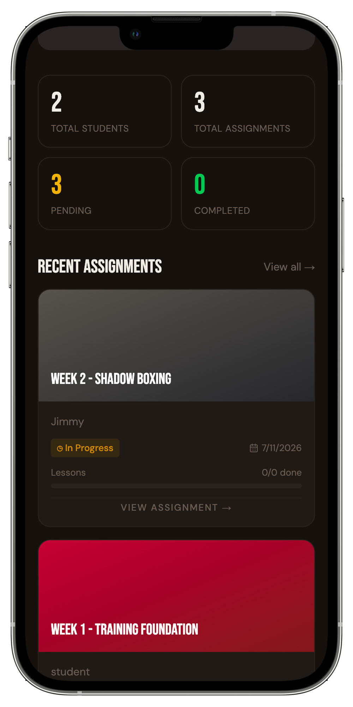

# Formjo

A coaching platform that connects coaches and athletes through structured lesson plans, video submissions, and voice feedback. Built for sports where
technique is everything.

Designed and built solo as a General Assembly Software Engineering capstone. A UX designer who codes — the engineering decisions start with how it feels to
use.

## Technology Stack

**Frontend**

- **React** for UI components and state management
- **Vite** for fast build tooling and hot module replacement
- **Tailwind CSS** for utility-first styling and dual-mode theming
- **shadcn/ui** for accessible, composable UI primitives
- **Framer Motion** for scroll-driven animations
- **GSAP** for hamburger menu and card transition animations
- **React Router** for client-side routing and protected routes

**Backend**

- **Python + Flask** for the REST API
- **PostgreSQL** for the relational database (13 tables)
- **psycopg2** for raw SQL queries with parameterised inputs
- **bcrypt** for password hashing
- **Cloudinary** for voice feedback audio storage

## Core Features

### Landing Page

- Scroll-driven hero animation: image shrinks from full-screen to thumbnail using Framer Motion `useScroll` and `useTransform` across a 300vh sticky scroll
  zone
- 3-column features section with sticky centre image that swaps based on per-element scroll visibility
- Interactive SVG curved marquee (`CurvedLoop`) with drag-to-reverse and velocity tracking
- Animated 4-phase project timeline with scroll-triggered dot colour transitions
- Dual-mode theming in OKLCH color space — dark for coaches, light for students

### Coach Dashboard

- Overview of all assigned modules and student progress
- Create, edit, and delete lessons with structured steps, YouTube embeds, or file upload
- Organise lessons into modules and assign them to students with an optional due date
- Leave text or voice feedback on each student submission

### Student Dashboard



- View all assigned modules with progress tracking per lesson
- Submit training videos via YouTube link
- Reply to coach feedback with text or voice recorded directly in the browser

### Voice Feedback

- Records audio directly in the browser using the Web Audio API and MediaRecorder
- Preview before sending, discard and re-record at any time
- Uploads to Cloudinary and attaches to the feedback thread
- One-time consent gate persisted via localStorage

### Lesson Submission Flow

- Students submit a YouTube link per lesson inside an assignment
- Each submission shows the embedded video, optional notes, and its full feedback thread
- Multiple attempts are supported — each tracked as a numbered attempt card

## Project Structure

formjo/
├── backend/
│ ├── db/
│ │ └── db_pool.py # psycopg2 connection pool
│ ├── resources/
│ │ ├── auth.py # signup, signin, signout
│ │ ├── lesson.py # lesson CRUD with steps
│ │ ├── module.py # module CRUD
│ │ ├── assignment.py # assignment CRUD, coach + student views
│ │ ├── submission.py # submission CRUD
│ │ └── comment.py # text + voice comment CRUD
│ └── main.py # Flask app, blueprint registration
└── frontend/
└── src/
├── assets/ # Images and design files
├── components/
│ ├── landing/ # HeroSection, FeaturesSection, TimelineSection, TeamSection, FooterSection, CurvedLoop
│ ├── VoiceRecorder.jsx
│ ├── Navbar.jsx
│ └── CardNav.jsx # GSAP animated mobile nav
├── context/
│ └── AuthContext.jsx # JWT auth + dual-mode theme toggle
└── pages/
├── Coach/
│ ├── lessons/ # LessonList, LessonDetail, LessonCreate, LessonEdit
│ ├── modules/ # ModuleList, ModuleDetail, ModuleCreate, ModuleEdit
│ └── assignments/ # AssignmentList, AssignmentDetail, AssignmentCreate, CoachAssignmentLesson
└── Student/
└── assignments/ # StudentAssignmentList, StudentAssignmentDetail, StudentLessonDetail

## Getting Started

### Prerequisites

- Node.js 18+
- Python 3.10+
- PostgreSQL running locally

### 1. Clone the repo

```bash
git clone https://github.com/your-username/formjo.git
cd formjo

2. Set up the database

Create a PostgreSQL database, then run the schema:

psql -d your_database_name -f schema.sql

Optionally seed demo data:

cd backend
python seed.py

3. Backend

cd backend
pip install -r requirements.txt

Create a .env file inside backend/:

DATABASE_URL=postgresql://localhost/your_database_name
JWT_SECRET_KEY=your_secret_key

python main.py

4. Frontend

cd frontend
npm install

Create a .env file inside frontend/:

VITE_API_URL=http://localhost:5000
VITE_CLOUDINARY_CLOUD_NAME=your_cloud_name
VITE_CLOUDINARY_UPLOAD_PRESET=your_upload_preset

npm run dev

Demo Accounts

Coach:    coach@demo.com   / password123
Student:  student@demo.com / password123

Development Process

Phase 1 — Foundations

Designed the full data model: 13 database tables covering users, lessons, modules, assignments, submissions, and feedback. Built the Flask REST API with JWT
authentication, psycopg2 connection pooling, and bcrypt password hashing.

Phase 2 — Core Features

Built the full CRUD workflow for both roles. Lessons with structured steps, modules, assignments with due dates, YouTube video submissions, and a voice
feedback system using the Web Audio API with Cloudinary upload.

Phase 3 — The Experience

Built the dual-mode UI (dark for coaches, light for students) and the animated landing page: scroll-driven hero, sticky image swap features section, GSAP
hamburger nav, and the CurvedLoop interactive SVG marquee.

Phase 4 — Stretch Goals

Push notifications, a formal coach-student invite and roster system, direct video file uploads, and an analytics dashboard for coaches.

Future Enhancements

- Push notifications when coaches leave voice or text feedback
- Coach-student invite system with roster management
- Direct video file uploads beyond YouTube-only submissions
- Password reset via email
- Analytics dashboard for coaches to track student progress over time
```
